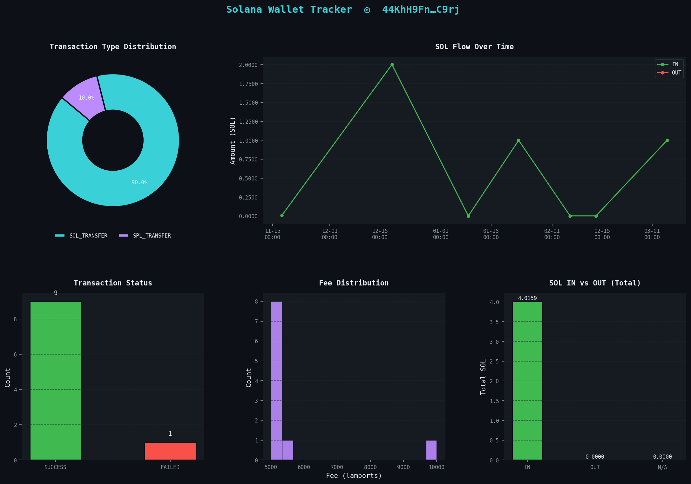
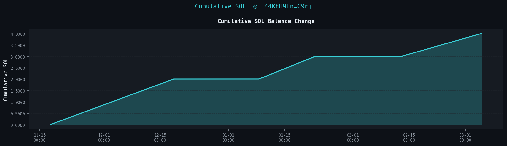

# 🔭 Solana Wallet Tracker

> **Real-time SOL Transaction Monitor** — Built with Rust  
> Portfolio Project by [roybeey.com](https://roybeey.com)


---

## 📌 Overview

**Solana Wallet Tracker** is a command-line tool written in **Rust** that monitors Solana wallet activity in real-time. It fetches transaction history and balance directly from the Solana JSON-RPC API (no third-party SDK required at runtime), parses different transaction types, displays a formatted CLI summary, exports results to CSV, and generates dark-theme analytical charts via Python.

This is my **first Rust project**, built as part of my blockchain analytics portfolio alongside existing projects including an OKX Trading Bot, On-chain Whale Tracker, and Python Blockchain Analytics.

---

## ✨ Features

| Feature | Description |
|---|---|
| 💰 Balance Fetch | Get current SOL balance of any wallet |
| 📜 Transaction History | Fetch last N transaction signatures |
| 🔍 Transaction Parsing | Detect SOL transfers, SPL token transfers, program interactions |
| 📊 CLI Summary Table | Color-coded terminal output with direction (IN/OUT), status, amount |
| 💾 CSV Export | Export all parsed transactions to structured CSV |
| 📈 Python Visualizer | 6-panel dark theme dashboard + cumulative SOL chart |
| ⚙️ Custom RPC | Support any Solana-compatible RPC endpoint |

---

## 🖥️ Demo Output

### CLI Terminal
```
  SUMMARY
  Wallet        : vines1vzrYbzLMRdu58ou5XTby4qAqVRLmqo36NKPTg
  Total Txns    : 10
  Status        : 9 SUCCESS  |  1 FAILED
  Total IN      : 4.015860 SOL
  Total OUT     : 0.000000 SOL
  Net           : +4.015860 SOL
  Total Fees    : 0.000056 SOL

  TIME                 SIGNATURE            TYPE     AMOUNT       DIR    STATUS
  ────────────────────────────────────────────────────────────────────────
  2026-03-05 02:51     5AU6NLb4MzhMXKYC…    SOL_TX   1.0000 SOL    IN   ✔
  2026-02-13 06:29     3hDUyQ8sSD14m38i…    SOL_TX   0.0010 SOL    IN   ✔
  2026-02-07 09:04     26yVedNpWhXnRtLr…    SPL_TX   10.0000 E9aD… N/A  ✔
  2026-01-22 16:26     2V2erUdPadyTiFRF…    SOL_TX   1.0000 SOL    IN   ✘
```

### Dashboard Chart


### Cumulative SOL Balance


---

## 🗂️ Project Structure
```
solana-wallet-tracker/
├── src/
│   ├── main.rs          # Entry point, CLI argument parsing, orchestration
│   ├── tracker.rs       # Solana RPC HTTP client (balance, signatures, transactions)
│   ├── parser.rs        # Transaction parser + CLI summary table renderer
│   └── exporter.rs      # CSV export using the `csv` crate
├── output/
│   └── transactions.csv # Generated transaction data
├── charts/
│   ├── visualize.py     # Python visualization script (matplotlib + seaborn)
│   ├── dashboard.png    # Generated 6-panel analytics dashboard
│   └── cumulative.png   # Generated cumulative SOL balance chart
├── Cargo.toml           # Rust dependencies
├── requirements.txt     # Python dependencies
└── README.md
```

---

## ⚙️ Installation

### Prerequisites

| Tool | Version | Install |
|---|---|---|
| Rust | ≥ 1.70 | [rustup.rs](https://rustup.rs) |
| Python | ≥ 3.9 | [python.org](https://python.org) |
| Git | any | [git-scm.com](https://git-scm.com) |

### 1. Clone the repository
```bash
git clone https://github.com/roybeey0/solana-wallet-tracker.git
cd solana-wallet-tracker
```

### 2. Build the Rust binary
```bash
cargo build --release
```

> ⏳ First build takes 3–5 minutes due to Solana SDK dependencies. Subsequent builds are fast (~1s).

### 3. Install Python dependencies
```bash
pip install -r requirements.txt
```

---

## 🚀 Usage

### Basic
```bash
cargo run -- <WALLET_ADDRESS>
```

### With options
```bash
cargo run -- <WALLET_ADDRESS> --limit 20 --output output/my_wallet.csv
```

### All options
```
USAGE:
  solana-wallet-tracker <WALLET_ADDRESS> [OPTIONS]

OPTIONS:
  --limit <N>      Number of transactions to fetch (default: 20)
  --output <FILE>  CSV output path (default: output/transactions.csv)
  --rpc <URL>      Custom RPC URL (default: https://api.mainnet-beta.solana.com)
  --help           Show help message
```

### Examples
```bash
# Track a wallet on mainnet (last 20 transactions)
cargo run -- 9WzDXwBbmkg8ZTbNMqUxvQRAyrZzDsGYdLVL9zYtAWWM

# Track on devnet with 50 transactions
cargo run -- vines1vzrYbzLMRdu58ou5XTby4qAqVRLmqo36NKPTg --limit 50 --rpc https://api.devnet.solana.com

# Use custom output path
cargo run -- <WALLET> --limit 30 --output output/whale_analysis.csv

# Use a custom RPC (e.g. Helius with API key)
cargo run -- <WALLET> --rpc https://mainnet.helius-rpc.com/?api-key=YOUR_KEY
```

### Run the visualizer

After tracking, generate charts from the exported CSV:
```bash
python charts/visualize.py
```

This generates two files in `charts/`:
- `dashboard.png` — 6-panel analytics dashboard
- `cumulative.png` — cumulative SOL balance change over time

---

## 📦 Dependencies

### Rust (`Cargo.toml`)

| Crate | Version | Purpose |
|---|---|---|
| `reqwest` | 0.11 | Async HTTP client for RPC calls |
| `tokio` | 1 | Async runtime |
| `serde` + `serde_json` | 1 | JSON serialization / deserialization |
| `csv` | 1 | CSV file writing |
| `chrono` | 0.4 | Timestamp formatting |
| `colored` | 2 | Terminal color output |
| `solana-client` | 1.18 | Solana type definitions |
| `solana-sdk` | 1.18 | Solana SDK utilities |

### Python (`requirements.txt`)

| Package | Purpose |
|---|---|
| `pandas` | CSV loading and data manipulation |
| `matplotlib` | Base charting engine |
| `seaborn` | Statistical chart styling |

---

## 🏗️ Architecture
```
main.rs  (CLI + Orchestrator)
    │
    ├──▶ tracker.rs  (HTTP Layer)
    │        ├── get_balance()       → getBalance RPC
    │        ├── get_signatures()    → getSignaturesForAddress RPC
    │        └── get_transaction()   → getTransaction RPC (jsonParsed + json fallback)
    │
    ├──▶ parser.rs   (Parse + Display Layer)
    │        ├── parse_transaction() → Detects SOL / SPL / Program Interaction
    │        └── print_summary()     → Renders colored CLI table
    │
    └──▶ exporter.rs (Output Layer)
             └── export_csv()        → Serializes Vec<ParsedTransaction> to CSV
```

### Transaction Type Detection Logic
```
getTransaction response
        │
        ├── instruction.program == "system" && type == "transfer"
        │       └── SOL_TRANSFER  ✓  (amount in lamports → SOL)
        │
        ├── instruction.program == "spl-token" && type == "transfer|transferChecked"
        │       └── SPL_TRANSFER  ✓  (uiAmount or raw amount)
        │
        └── anything else
                └── PROGRAM_INTERACTION  (DeFi, NFT mint, staking, etc.)
```

---

## 📊 CSV Output Schema

The exported `transactions.csv` contains the following columns:

| Column | Type | Example |
|---|---|---|
| `signature` | string | `5AU6NLb4Mzh...` |
| `block_time` | datetime | `2026-03-05 02:51:00` |
| `slot` | u64 | `446287791` |
| `tx_type` | string | `SOL_TRANSFER` |
| `direction` | string | `IN` / `OUT` / `N/A` |
| `amount_sol` | f64 | `1.000000` |
| `token_symbol` | string | `SOL` / `E9aDEcxZ…` |
| `from_address` | string | full base58 pubkey |
| `to_address` | string | full base58 pubkey |
| `program_id` | string | full base58 program ID |
| `fee_sol` | f64 | `0.000005` |
| `status` | string | `SUCCESS` / `FAILED` |

---

## ⚠️ RPC Limitations

Public Solana RPC endpoints only store **~2–3 days** of recent transaction data. Older transactions will return `null` and be skipped with a warning:
```
⚠ Skipping <sig>: Transaction not found (tried all encodings)
```

**This is a Solana infrastructure limitation, not a bug.**

### Solutions

| Option | Cost | Full History |
|---|---|---|
| `api.mainnet-beta.solana.com` | Free | ❌ Recent only |
| `api.devnet.solana.com` | Free | ✅ Good for testing |
| [Helius](https://helius.dev) | Free tier (1000 req/day) | ✅ |
| [QuickNode](https://quicknode.com) | Paid | ✅ |
| [Triton](https://triton.one) | Paid | ✅ |

For portfolio demo and testing, **devnet** works perfectly and returns full history.

---

## 🧠 What I Learned

Building this as my first Rust project, key concepts applied:

- **Async/await** with `tokio` for non-blocking RPC calls
- **Error handling** with `Result<T, String>` propagation using `?` operator
- **Struct serialization** with `serde` derive macros for CSV export
- **Pattern matching** for JSON parsing without panicking on missing fields
- **Module system** — splitting logic across `mod tracker`, `mod parser`, `mod exporter`
- **Ownership and borrowing** — passing `&str` slices vs owned `String` correctly
- **Rate limiting** — 200ms sleep between RPC calls to avoid 429 on public nodes

---

## 🔮 Future Improvements

- [ ] WebSocket support for truly real-time streaming (`slotSubscribe`)
- [ ] Token symbol resolution via Jupiter token list API
- [ ] Multi-wallet tracking mode
- [ ] SQLite storage for persistent transaction history
- [ ] Discord/Telegram alert on large transactions
- [ ] Web dashboard with Axum + HTMX

---

## 👤 Author

**Roybeey** — Data Science & AI Student at UBAYA Surabaya  
Portfolio: [roybeey.com](https://roybeey.com)

Other blockchain projects:
- OKX Trading Bot
- On-chain Whale Tracker  
- Python Blockchain Analytics
- Smart Contract Interaction

---

## 📄 License

MIT License — free to use, modify, and distribute.